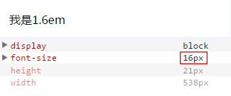
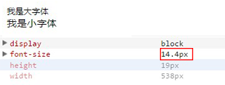
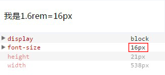
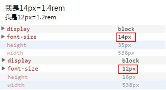

# css 单位中 px 和 em,rem 的区别

## px（绝对长度单位）

相信对于前端来说 px 这个单位是大家并不陌生，px 这个单位，兼容性可以说是相当可以，大家对 px 的了解肯定是没有很大的问题的。

## em（相对长度单位）

### 使用：

1. 浏览器的默认字体都是 16px，那么 1em=16px，以此类推计算 12px=0.75em，10px=0.625em，2em=32px；

2. 这样使用很复杂，很难很好的与 px 进行对应,也导致书写、使用、视觉的复杂(0.75em、0.625em 全是小数点)；

3. 为了简化 font-size 的换算，我们在 body 中写入一下代码

body {font-size: 62.5%; } /* 公式 16px*62.5%=10px \*/

这样页面中 1em=10px,1.2em=12px,1.4em=14px,1.6em=16px，使得视觉、使用、书写都得到了极大的帮助。

例子如下：

```
<div class="font1" style='font-size:1.6em'>我是1.6em</div>
```

运行效果为：



### 缺点：

1、em 的值并不是固定的；

2、em 会继承父级元素的字体大小（参考物是父元素的 font-size；）；

3、em 中所有的字体都是相对于父元素的大小决定的；所以如果一个设置了 font-size:1.2em 的元素在另一个设置了 font-size:1.2em 的元素里，而这个元素又在另一个设置了 font-size:1.2em 的元素里，那么最后计算的结果是 1.2X1.2X1.2=1.728em

例如：

```
<div class="big">
    我是大字体
   <div class="small">我是小字体</div>
</div>
样式为

<style>
     body {font-size: 62.5%; } /*  公式:16px*62.5%=10px  */
    .big{font-size: 1.2em}
    .small{font-size: 1.2em}
</style>
```

但运行结果 small 的字体大小为：1.2em\*1.2em=1.44em

如图：



\*宽度高度也是同理

## rem（相对长度单位）

### 使用：

1. 浏览器的默认字体都是 16px，那么 1rem=16px，以此类推计算 12px=0.75rem，10px=0.625rem，2rem=32px；

2. 这样使用很复杂，很难很好的与 px 进行对应,也导致书写、使用、视觉的复杂(0.75rem、0.625em 全是小数点) ；

3. 为了简化 font-size 的换算，我们在根元素 html 中加入 font-size: 62.5%;

html {font-size: 62.5%; } /* 公式 16px*62.5%=10px \*/  
这样页面中 1rem=10px,1.2rem=12px,1.4rem=14px,1.6rem=16px;使得视觉、使用、书写都得到了极大的帮助；

例子如下：

```
<div class="font1" style='font-size:1.6rem'>我是1.6rem=16px</div>
```

运行效果为：



### 特点：

1. rem 单位可谓集相对大小和绝对大小的优点于一身

2. 和 em 不同的是 rem 总是相对于根元素(如:root{})，而不像 em 一样使用级联的方式来计算尺寸。这种相对单位使用起来更简单。

3. rem 支持 IE9 及以上，意思是相对于根元素 html（网页），不会像 em 那样，依赖于父元素的字体大小，而造成混乱。使用起来安全了很多。

例如：

```
<div class="big">
    我是14px=1.4rem<div class="small">我是12px=1.2rem</div>
</div>
样式为：

<style>
    html {font-size: 10px;  } /*  公式16px*62.5%=10px  */
    .big{font-size: 1.4rem}
    .small{font-size: 1.2rem}
</style>
```

运行结果：



注意：

值得注意的浏览器支持问题： IE8，Safari 4 或 iOS 3.2 中不支持 rem 单位。
如果你的用户群都使用最新版的浏览器，那推荐使用 rem，如果要考虑兼容性，那就使用 px,或者两者同时使用。
