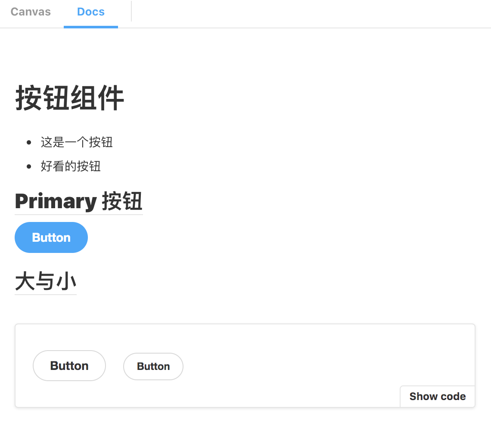
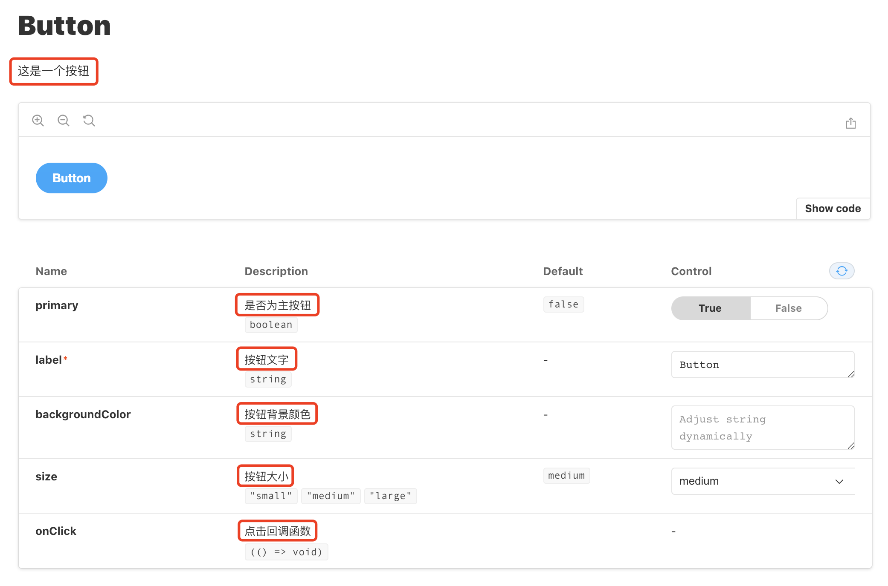

## Storybook 使用


### Storybook是什么

使用 Storybook 可以为你的项目一键生成样式指南(Style Guide)页面。

使用 **组件驱动开发(CDD)** 的模式，首先完成基础组件，通过组件复用的方式构建功能模块和页面。
使用 CDD 开发有如下好处：

1. 开发和设计更方便交流，更快速的迭代产品原型
2. UI与业务分离，基础组件中间无依赖，可以并行开发
3. 组件拆分更合理、规范，整体风格由基础组件决定，可以保证UI风格的统一性
4. 组件包含文档和样例，方便其他人员开始使用

### Storybook 优点

1. 环境配置简单快捷，一条命令即可完成配置 (CRA 基础上)。
2. 样式指南编写简单，可自动提取 Props 定义、组件名称等，无需繁琐步骤即可使用。
3. 提供插件机制，功能可扩展，默认支持响应式设计，预览背景，实时属性更改，自动化文档等。
4. 支持 MDX 格式，可编写带组件预览的 Markdown 文档，亦可作为纯文档使用。
5. 可以独立打包成 App，作为 UI 文档发布。

### 安装

在项目中运行

```
  npx sb init 
```

会在项目中生成如下文件

```
.storybook
├── main.js     // stories 路径和插件配置
└── preview.js  // 全局组件预览配置

src
├── index.tsx
└── stories     // 默认生成的 Demo
    ├── Button.stories.tsx
    ├── Button.tsx
    ├── Header.stories.tsx
    ├── Header.tsx
    ├── Introduction.stories.mdx
    ├── Page.stories.tsx
    ├── Page.tsx
    ├── assets
    │   ├── code-brackets.svg
    │   ├── colors.svg
    │   ├── comments.svg
    │   ├── direction.svg
    │   ├── flow.svg
    │   ├── plugin.svg
    │   ├── repo.svg
    │   └── stackalt.svg
    ├── button.css
    ├── header.css
    └── page.css
```

除此之外，还会自动修改`package.json`，添加相关依赖和 scripts

```
{
  "storybook": "start-storybook -p 6006 -s public",
  "build-storybook": "build-storybook -s public"
}
```

运行`yarn storybook`即可直接预览 Demo

### 编写 Stories

#### 概述

Story文件以.stories.tsx 结尾， 如存在自定义文档，则以.stories.mdx结尾。
每个story为一个菜单项，通过ESModule的形式导出。

default导出为页面配置(组件、标题)

export 导出为组件的每种 Props 枚举的样式，可添加多种展示方式。

```
import React from 'react';
import { Story, Meta } from '@storybook/react/types-6-0';

import { Button, ButtonProps } from './Button';

export default {
  title: 'Example/Button',
  component: Button,
} as Meta;

const Template: Story<ButtonProps> = (args) => <Button {...args} />;

export const Primary = Template.bind({});
Primary.args = {
  primary: true,
  label: 'Button',
};

export const Secondary = Template.bind({});
Secondary.args = {
  label: 'Button',
};

```

#### 组件预览页面

首先配置组件默认导出，必填项为`title`

```
  export default {
      title: 'Example/Button',
      component: Button,
  } as Meta;
```

- title: 用于组织菜单层次结构，可以通过/创建子目录（如：Example/Component/Button）
- component: Story 相关的组件（用于自动生成文档等）

导出每个组件有两种方式:

- 可直接导出组件

```
  export const Menu: React.VFC = (props) => {
  return (
    <Menu defaultIndex='0' onSelect={(index) => {action(`clicked ${index} item`)}} >
    </Menu>
  )
}
```

> 参数增加props可出现Props控制选项，不加则没有

- 使用 Args 方式导出（推荐）

```
  const Template: Story<ButtonProps> = (args) => <Button {...args} />;

  export const Primary = Template.bind({});
  Primary.args = {
     primary: true,
     label: 'Button',
  };
```
使用 Args 导出模式可自动添加 Props 相关控制选项，并且重用 Props 很方便

```
 const Secondary = ButtonStory.bind({});
 Secondary.args = {
    ...Primary.args,
    primary: false,
  };
```

### 自定义组件文档

Storybook 支持自行编写组件相关文档，文件后缀名为`.stories.mdx`
MDX = Markdown + JSX

首先需要先定义菜单名称和相关组件（类似`.stories.tsx`的默认导出）

```
import { Meta, Canvas, Story } from '@storybook/addon-docs/blocks';
import { Button } from './Button';

<Meta title="Documents/Button" component={Button} />;
```

接下来可以使用 Markdown 语法和 Canvas、Story 等 JSX 标记编写文档

```
export const Template = (args) => <Button {...args} />;

# 按钮组件

- 这是一个按钮
- 好看的按钮

## Primary 按钮

<Story name="Primary" args={{ primary, label: 'Button' }}>
{Template.bind({})}
</Story>

## 大与小

<Canvas>
  <Story name="Large" args={{ size: 'large', label: 'Button' }}>
    {Template.bind({})}
  </Story>
  <Story name="Small" args={{ size: 'small', label: 'Button' }}>
    {Template.bind({})}
  </Story>
</Canvas>
```
- `Story:` 组件展示
- `Canvas:` 包含代码片段展示块

此段代码生成如下效果



> 每个 Story 块生成一个子项，多个子项共用一个文档


### 组件注释方法

组件 Props 注释（用于生成文档的 Props 描述文字）

组件行首注释（用于生成文档的组件描述文字）

```
 import React from 'react';

 export interface ButtonProps {
  /** 是否为主按钮 */
  primary?: boolean;
  /** 按钮背景颜色 */
  backgroundColor?: string;
  /** 按钮大小 */
  size?: 'small' | 'medium' | 'large';
  /** 按钮文字 */
  label: string;
  /** 点击回调函数 */
  onClick?: () => void;
}

/** 这是一个按钮 */
export const Button: React.FC<ButtonProps> = ({
  primary = false,
  size = 'medium',
  backgroundColor,
  label,
  ...props
}) => {
  return (
    <button
      type="button"
      className={[
        'storybook-button',
        `storybook-button--${size}`,
        primary ? 'storybook-button--primary' : 'storybook-button--secondary',
      ].join(' ')}
      style={{ backgroundColor }}
      {...props}
    >
      {label}
    </button>
  );
};
```
此段代码生成如下效果（注意红框内的文字）



### 常用配置

Storybook 配置可分别指定作用范围，分为组件配置、Story 文件配置、全局配置，继承关系如下：

- 全局配置

`.storybook/preview.js`

```
export const parameters = {
  backgrounds: {
    default: 'twitter',
    values: [
      {
        name: 'twitter',
        value: '#00aced',
      },
      {
        name: 'facebook',
        value: '#3b5998',
      },
    ],
  },
};
```
- Story 文件配置

`Button.stories.js`

```
  export default {
  title: 'Button',
  parameters: {
    backgrounds: {
      default: 'twitter',
      values: [
        { name: 'twitter', value: '#00aced' },
        { name: 'facebook', value: '#3b5998' },
      ],
    },
  },
};
```

- 组件配置

```
  export const Primary = …
  Primary.decorators = [(Story) => <div style={{ padding: '3em' }}><Story/></div>]
```

### 自定义 Controls 类型

在 Controls 面板中，Storybook 会自动通过 Props 的类型选择合适的控件，也可以手动指定需要的控件。

`.stories.tsx`

```
  export default {
  title: 'Button',
  component: Button,
  argTypes: {
    backgroundColor: { control: 'color' },
    loadingState: {
      control: {
        type: 'inline-radio',
        options: ['loading', 'error', 'ready'],
      },
    },
    width: {
      control: {
        type: 'range',
        min: 400,
        max: 1200,
        step: 50,
      },
    },
  },
};
```

`argTypes`属性可以指定某个 Props 使用指定的控件。更多`Control`属性参考文档

### 自定义 Props 描述

Story 可以覆盖默认的 Props 描述（来自静态代码分析）

还可以添加大段文字，以说明 Props 的用途

```
  export default {
  title: 'Example/Button',
  component: Button,
  argTypes: {
    label: {
      name: '标签',
      type: {
        required: false,
      },
      description: 'overwritten description',
      table: {
        type: {
          summary: 'something short',
          detail: 'something really really long',
        },
        defaultValue: {
          summary: 'default summary',
          detail: 'default detail',
        },
      },
      control: {
        type: null,
      },
    },
  },
} as Meta;
```

### 插件系统

官方插件列表：https://github.com/storybookjs/storybook/tree/master/addons

添加插件的一般步骤

  1. 使用 yarn 或 npm 安装相关依赖
  2. 修改`.storybook/main.js`中的`addons`字段，添加插件
  3. 在`.storybook/preview.js`中添加相关配置（可选）

### 快照测试

1. 安装插件：yarn add --dev @storybook/addon-storyshots react-test-renderer
2. 在src/stories中新建文件snapshoot.test.ts

```
import initStoryshots from '@storybook/addon-storyshots';

initStoryshots();
```

 3. 运行yarn test即可在src/stories中生成__snapshots__文件夹，包含 stories 中组件的快照

  

### 更多参考
[官方文档](https://storybook.js.org/docs/react/get-started/introduction)